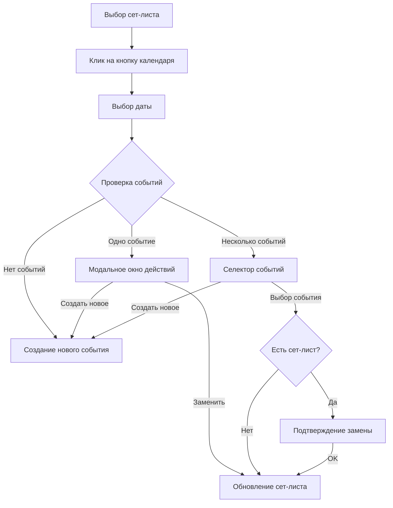

# 📅 РУКОВОДСТВО ПО ИНТЕГРАЦИИ СЕТ-ЛИСТОВ С СОБЫТИЯМИ

## 🎯 ОБЗОР ФУНКЦИОНАЛА

Интеграция позволяет пользователям с правами администратора и модератора добавлять сет-листы в события календаря прямо из панели сет-листов. Функционал реализован в декабре 2024 года.

## 🔑 КЛЮЧЕВЫЕ ВОЗМОЖНОСТИ

1. **Добавление сет-листа в календарь** - кнопка появляется только для admin/moderator
2. **Выбор даты** - стильный темный календарь в едином стиле с проектом
3. **Проверка событий** - автоматическая проверка существующих событий на выбранную дату
4. **Три сценария действий**:
   - Нет событий → создание нового с предвыбранным сет-листом
   - Одно событие → выбор: заменить сет-лист или создать новое событие
   - Несколько событий → выбор из списка или создание нового

## 🏗️ АРХИТЕКТУРА КОМПОНЕНТОВ

```
/src/modules/integration/
├── datePickerModal.js      - Модальное окно выбора даты
├── eventChecker.js         - Проверка событий на выбранную дату
├── eventActionModal.js     - Модальное окно действий (одно событие)
├── eventSelectorModal.js   - Селектор из нескольких событий
├── integrationStyles.css   - Стили для модального окна даты
├── calendarStyles.css      - Стили календаря
├── eventActionStyles.css   - Стили модального окна действий
└── eventSelectorStyles.css - Стили селектора событий

/styles/
└── event-creation-modal-complete.css - Полные стили модального окна создания события
```

## 📊 FLOW ИНТЕГРАЦИИ



## 🔐 ПРАВА ДОСТУПА

```javascript
// Проверка прав в ui.js
if (canManageEvents()) {
    addToCalendarBtn.style.display = 'block';
} else {
    addToCalendarBtn.style.display = 'none';
}

// canManageEvents() возвращает true для:
// - role === 'admin'
// - role === 'moderator'
```

## 💡 КЛЮЧЕВЫЕ ОСОБЕННОСТИ РЕАЛИЗАЦИИ

### 1. Кнопка в панели сет-листов
- Расположение: между кнопками "Презентация" и закрытия панели
- Иконка: `fa-calendar-plus`
- Видимость: только для admin/moderator
- Активность: только при выбранном сет-листе

### 2. Модальное окно выбора даты
```javascript
// Минималистичный дизайн
- Темный фон (#1a1f2e)
- Календарь без лишних элементов
- Клик по дате = выбор (без кнопок подтверждения)
- Название сет-листа отображается в заголовке
```

### 3. Проверка событий (eventChecker.js)
```javascript
// Фильтрация по:
- branchId (текущий филиал пользователя)
- isArchived: false
- date (сравнение только дат, без времени)

// Обход требования индексов Firestore:
// Сначала запрос по branchId, затем клиентская фильтрация
```

### 4. Селектор событий (кликабельные карточки)
- Компактные карточки с информацией о событии
- Клик по карточке = выбор события
- Если есть сет-лист → диалог подтверждения замены
- Если нет сет-листа → сразу добавление
- Кнопка "Создать новое событие" внизу

### 5. Обновление сет-листа в событии
```javascript
// eventsApi.js - updateEventSetlistApi
- Обновляет setlistId
- Пересчитывает songCount
- Обновляет updatedAt timestamp
```

## 🎨 СТИЛИСТИЧЕСКИЕ РЕШЕНИЯ

### 1. Единообразие с events страницей
- Все модальные окна используют стили из events-page.css
- Темная цветовая схема
- Компактные отступы для мобильных устройств

### 2. CSS организация
```css
/* Изолированные стили для event-creation-modal */
.event-creation-modal { /* стили применяются только к этому классу */ }

/* Глобальные стили для participant-selector */
.participant-selector { /* так как добавляется в body */ }
```

### 3. Адаптивность
- Модальные окна: max-width 90%, max-height 85vh
- Календарь: адаптируется под размер экрана
- Кнопки: увеличенные зоны клика для мобильных

## ⚠️ ВАЖНЫЕ МОМЕНТЫ

### 1. Service Worker
- **ВСЕГДА** увеличивайте версию при изменениях
- Добавляйте новые файлы в urlsToCache
- Текущая версия: v418+

### 2. Firebase
- Используется ТОЛЬКО v8 синтаксис
- Firestore Timestamp для дат
- Денормализованные поля (songCount, leaderName)

### 3. Модальное окно создания события
- Использует eventModal.js как wrapper
- Предзаполнение сет-листа через preselectedSetlistId
- Стили в event-creation-modal-complete.css

### 4. Обработка ошибок
- Try-catch блоки во всех асинхронных операциях
- Уведомления пользователю через showNotification
- Логирование через logger.js

## 🐛 ИЗВЕСТНЫЕ ОСОБЕННОСТИ

## 🔗 Шеринг события (WhatsApp/Telegram) — форматирование

- Участники:
  - Заголовок «👥 Участники»
  - Группировка по инструментам; сортировка по `getInstrumentOrder`
  - Эмодзи перед названием инструмента
- Песни:
  - Заголовок «🎶 Список песен»
  - Строка: «• Название — Тональность»
  - Telegram: если есть YouTube Link в `Songs`, указывать URL в скобках
- Ссылка на событие: одна, внизу

Реализация: `/public/event/event-page.js` → `shareEvent(platform)`

1. **Participant selector стили**
   - Применяются глобально (не под .event-creation-modal)
   - Префикс .participant-selector для изоляции от других списков

2. **Date handling**
   - Firestore Timestamp ↔ JavaScript Date конверсия
   - Сравнение только дат (без времени) для событий

3. **Modal z-index**
   - Календарь: z-index 9999
   - Селектор событий: z-index 10000
   - Создание события: z-index 10001

## 📝 ЧЕКЛИСТ ДЛЯ БУДУЩИХ ИЗМЕНЕНИЙ

При внесении изменений в интеграцию:

- [ ] Проверить права доступа (canManageEvents)
- [ ] Обновить Service Worker версию
- [ ] Проверить работу на мобильных устройствах
- [ ] Убедиться в изоляции CSS стилей
- [ ] Проверить Firebase v8 синтаксис
- [ ] Обновить эту документацию

## 🚀 ДАЛЬНЕЙШЕЕ РАЗВИТИЕ

Планируемые улучшения:
1. Архив сет-листов (общий и персональный)
2. Массовое добавление сет-листов в события
3. Копирование событий с сет-листами
4. История изменений сет-листов в событиях